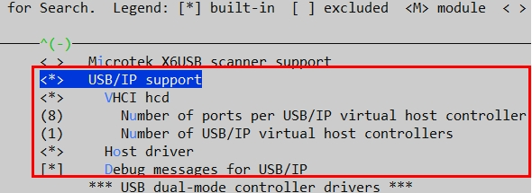

# WSL USB Linux Kernel Setup  
This guide configures the Windows Subsystem for Linux (WSL) to natively support USB drivers, including cameras, when they are attached. By following these instructions, you'll build a custom WSL kernel to enable seamless integration of USB cameras and other devices within WSL.

These instructions are based on BConic's guide provided [here](https://askubuntu.com/questions/1405903/capturing-webcam-videowith-opencv-in-wsl2).

## Prerequisites
### 1. Default WSL Installation  
If you haven’t already installed WSL on Windows, follow [these instructions](https://learn.microsoft.com/en-us/windows/wsl/setup/environment) to set up the default WSL2 environment.  

### 2. USB Device Sharing  
To allow USB devices to be shared between Windows and WSL, configure your environment by following [these instructions](https://learn.microsoft.com/en-us/windows/wsl/connect-usb).  


**NOTE**
> Once you share a USB device from Windows into WSL, you will be able to attach it to WSL. When the device is attached, it will no longer be avaialable in Windows. In order to switch it back to Windows, you will have to detach it, or physically disconnect it from the computer. The powershell scripts in the /scripts directory allow you to do this easily. It is recommended you copy these to a folder on your Windows PATH so that you can easily connect and disconnect USB devices from the command line. You will need to edit each script specifically to specify which devices you want to share/attach/detach. See instructions provided within the scripts.

# Introduction

While USB devices can be shared with WSL using `usbipd` (a tool for forwarding USB devices into WSL), USB cameras present a unique challenge. USB cameras rely on **Video 4 Linux 2 (v4l2)**, the Linux API responsible for video device handling. Specifically:  

1. **Driver Registration**: For a USB camera to work in Linux, it must be associated with a `v4l2` driver, which registers the device as a `/dev/video#` node (where `#` is a number).  
2. **WSL Limitation**: By default, WSL does not include the necessary kernel drivers for `v4l2` or USB video class (UVC) devices. As a result, USB cameras shared with WSL via `usbipd` do not appear under `/dev/video#` and are unusable in applications like OpenCV.  


To enable USB cameras in WSL, you must build and install a custom WSL kernel with the appropriate support for:
- **USB video class (UVC) devices**  
- **Video 4 Linux 2 (v4l2)**  
- **GSPCA-based USB camera drivers**  

This guide walks you through compiling a custom WSL kernel that integrates these features, allowing USB cameras to work seamlessly in WSL environments.
This has been tested with the latest version- linux-msft-wsl-6.6.36.6, but it should be available for most versions with minor differences.


# 1) Compile the WSL Kernel with any Version
This example compiles the WSL source code in WSL2 (Ubuntu 22.04). This is the recommended method to compile the kernel. If your WSL is Ubuntu 22.04, then this can be done directly in your WSL terminal. To check what os distro and release version you're in, you can run"
```bash
cat /etc/os-release
```
## Step1: Install the dependencies
Before starting to compile the kernel, we first need to update your Linux package source and install the dependencies for compiling the kernel.
### Update Package Source
```bash
sudo apt update && sudo apt upgrade
```

### Install Dependencies According to the README File in the Source code
```bash
sudo apt install build-essential flex bison dwarves libssl-dev libelf-dev cpio
```

### Install Dependencies for Configuration 
```bash
sudo apt install libncurses-dev
```
## Step2: Get the source code
**You can clone the repo, or download it from the release page**

Remember to put them into a Linux system (i.e. directly in WSL2)


### Enter a Directory
```bash
cd ~
```

### Clone the Repo
For example, the tag "linux-msft-wsl-6.6.36.6" 
```bash
git clone --depth 1 -b linux-msft-wsl-6.6.36.6 https://github.com/microsoft/WSL2-Linux-Kernel.git
```
### OPTIONAL - Add the Realtime Patch
This is a good time to install any other patches that you may want in your Kernel. See instructions in [Install the PREEMPT Real-Time Patch](./realtime_patch.md).
Return here once you've added this patch if desired.

### Enter the Source Directory
```bash
cd WSL2-Linux-Kernel
```
## Step3. Config the WSL kernel with the command: 
```bash
make menuconfig KCONFIG_CONFIG=Microsoft/config-wsl
```

Then we can see a terminal GUI for configuration

- `General setup - Local version`： add a suffix -usb-add for later version check (you can add your own suffix)
  - 
  - 
- `Device Drivers-Multimedia support`: change it to * status (press space key), and then enter its config (press enter key)
  - 
  - change `Filter media drivers,Autoselect ancillary drivers (tuners, sensors, i2c, spi, frontends)` to `*` status
    - 
  - change `Media device types - Cameras and video grabbers` to `*` status 
    - 
  - change `Media drivers - Media USB Adapters` to `*` status, and then enter its config
    - 
    - change `GSPCA based webcams and USB Video Class (UVC)` to `"M"` status
      - 
    - enter `GSPCA based webcams`, change all USB camera drivers to `M` , because we don't know our camera mode type
      - 
- change `Device Drivers-USB support` to `*` status, and then enter its config
  - - 
  - change `Support for Host-side USB` to `*` status
    - 
  - change `USB/IP support` to `*` status, and then change all its subitems to `*` status
    - 

**OPTIONAL**
If you installed any other patches, this is where to configure them. For the Realtime PREEMPT patch, you can set the PREEMPT mode to realtime in:
- `General setup - Preemption Model` config:
  - `Preemption Model`: change it to `Fully Preemptible Kernel (Real-Time)`
  - 
  
Then, save them,and then exit with `Save` and `Exit` at the bottom \
Here’s an improved and clearer version of **Section 1) Step 4**, with better structure and language:

---

### **Step 4: Build the Kernel and Install the Modules**

#### **Compile the Kernel**
Run the following command to compile the kernel using the configuration file:
```bash
make KCONFIG_CONFIG=Microsoft/config-wsl -j$(nproc)
```

#### **Compile the Modules**
Compile all kernel modules defined in the configuration file:
```bash
sudo make KCONFIG_CONFIG=Microsoft/config-wsl modules -j$(nproc)
```

#### **Install the Modules**
Install the compiled kernel modules into the current system:
```bash
sudo make KCONFIG_CONFIG=Microsoft/config-wsl modules_install -j$(nproc)
```

After completing these steps:
- The compiled WSL kernel will be located at `./vmlinux`.
- The modules will be installed into your current WSL system under the directory:
  ```plaintext
  /lib/modules/<kernel-version>
  ```
  For example: `/lib/modules/6.6.36.6-microsoft-standard-WSL2-usb-add+`.
---

#### **Important Notes About Modules**
- The modules are installed in the current WSL distribution (or "distro"). They include any components configured with `M` status in **Step 3** of this guide.
- If the current WSL distribution (e.g., `Ubuntu`) is unregistered or deleted, the installed modules will also be removed.
- Other WSL distributions will lose access to these modules, as they are specific to the kernel version and the WSL environment where they were installed.
- If WSL is restarted, the modules will not automatically load until the distribution where they were installed is started. Simply opening the relevant WSL distro will initialize the modules.
---

#### **Backing Up Your Modules**
Recompiling the kernel and modules is time-consuming. To avoid repeating this process, it's recommended to back up the installed modules directory.

For detailed backup instructions, see **Section 5)** of this guide.

# 2) Replace the kernel with the default one
Now, you can copy the kernel into your Windows path and add the path to the WSL config file

## Step1: Copy your Kernel into your Windows path

```bash
sudo mkdir -p /mnt/c/WSL/kernel/ # Make the WSL directory on the C Drive in Windows if it doesn't already exist
sudo cp ./vmlinux /mnt/c/WSL/kernel/ # Copy the kernel to Windows in the C:/WSL/kernel/ directory
```
## Step1: Add the Path into the `C:/Users/{your user name}/.wslconfig` 
**NOTE: if this file doesn't exist, create a new one** \
> **Option 1: Create the File on the Windows Side** \
    Open Notepad. \
    Paste the content below \
    Save the file as .wslconfig in the `C:\Users\%USERNAME%\` directory.

```text
[wsl2]
kernel=C:\\WSL\\kernel\\vmlinux
```

> **Option 2: From WSL run the following commands** 
    
```bash
# Step 1: Get the Windows username
WIN_USERNAME=$(cmd.exe /C "echo %USERPROFILE%" | tr -d '\r' | sed -E 's|C:\\Users\\||')

# Step 2: Define the kernel path with double backslashes
KERNEL_PATH="C:\\\\\\\\WSL\\\\\\\\kernel\\\\\\\\vmlinux"

# Step 3: Create the .wslconfig file with the correctly escaped kernel path
echo -e "[wsl2]\nkernel=$KERNEL_PATH" | sudo tee "/mnt/c/Users/$WIN_USERNAME/.wslconfig" > /dev/null

# Step 4: Verify the .wslconfig file was created correctly
cat "/mnt/c/Users/$WIN_USERNAME/.wslconfig"

```

## Step3: From Windows Shutdown the WSL and restart it
```powershell
# Shutdown WSL
wsl --shutdown

# Restart WSL
wsl
```
> You may need to do this twice for it to take effect

## Step4: Check the WSL Version
```bash
uname -a
```
If you see the suffix (-usb-add), it means you have succeeded. The WSL kernel should support USB, and integrated camera now. You will also see which Preemption mode your WSL kernel is in. Here we can verify that we have correctly installed the PREEMPT_RT Real-Time mode.

Linux MY-WIN-PC 6.6.36.6-rt35-microsoft-standard-WSL2-`usb-add+` #2 SMP `PREEMPT_RT` Sat Jan 25 14:48:34 CST 2025 x86_64 x86_64 x86_64 GNU/Linux

# 3) Camera Test
If you want to use cameras, you should share the camera with WSL.

## Step1: If you haven't already, install `usbipd-win`. See the prerequistes for additional instructions.

## Step2: Run the commands below on your Windows with `Powershell`
> Alternatively, see the scripts in the /scripts folder for powershell scripts to make this easier.
### List All USB Devices
```powershell
usbipd list
```

### Share your Camera
Example: suppose your camera BUSID is "1-6"
```powershell
usbipd bind --busid 1-6 # this needs administration permission
```

### Attach to WSL
```powershell
usbipd attach --wsl --busid 1-6
```

## Step3: Enter WSL and Run the Commands Below
```bash
ls /dev/video*
```
If you see any video devices with the command above, it means you have succeeded. Now, you can use the camera with OpenCV in WSL.

# 4) Making Changes
If you need to make any changes to your configuration, make sure you first clean up your previous build with:
```bash
make clean
make mrproper
```
This removes most build artifacts, such as .o files and intermediate objects, but keeps the kernel configuration file (.config).
Then you can make your changes to your config with the instructions in **Section 1)**, `Step 3`.

You can recompile your kernel and modules with the instructions in **Section 1)**, `Step 4`.

You can update your kernel in windows with the instructions in **Section 2)**.

# 5) Backing Up Your Custom Kernel and Modules
Compiling the kernel and modules can be time-consuming, often taking over an hour. To avoid repeating the process, it’s a good idea to back up your work, including the compiled WSL kernel and modules. This will allow you to quickly restore your setup if needed.

## Step 1: Save the WSL Kernel (`vmlinux` File)
The `vmlinux` file is the compiled kernel. To back it up:
1. **On the WSL side, in the terminal**, copy the kernel file (`vmlinux`) from the directory where you compiled it (e.g., `~/WSL2-Linux-Kernel/`) into a permanent backup location on your Windows filesystem.
   ```bash
   sudo cp ~/WSL2-Linux-Kernel/vmlinux /mnt/c/WSL/backups/kernel/vmlinux
   ```
   - Replace `/mnt/c/WSL/backups/kernel/` with your preferred backup location on the Windows filesystem.

2. **On the Windows side**, verify the file exists in the backup location by navigating to the folder in File Explorer (e.g., `C:\WSL\backups\kernel`).

## Step 2: Back Up the Modules
The kernel modules are saved in `/lib/modules/`. To ensure you don’t lose them, compress the module directory into an archive file:
1. **On the WSL side, in the terminal**, package the modules folder into a `.tar.gz` file:
   ```bash
   sudo tar -zcvf /mnt/c/WSL/backups/modules.tar.gz /lib/modules/6.6.36.6-microsoft-standard-WSL2-usb-add+/
   ```
   - Replace `/mnt/c/WSL/backups/` with your preferred backup location on the Windows filesystem.

2. **On the Windows side**, verify the `.tar.gz` file exists in the backup location by navigating to the folder in File Explorer (e.g., `C:\WSL\backups\`).

---

### Restoring Your Backup
To restore the WSL kernel and modules, follow these steps:

#### 1. Restore the WSL Kernel
1. **On the WSL side, in the terminal**, copy the `vmlinux` file back into the directory you configured in your `.wslconfig` file:
   ```bash
   sudo cp /mnt/c/WSL/backups/kernel/vmlinux /mnt/c/WSL/kernel/vmlinux
   ```
   > If you get errors from WSL replacing the vmlinux file in the .wslconfig location, shut down wsl with `wsl --shutdown` and do this from the windows side.
   

2. **On the Windows side**, confirm that the `.wslconfig` file is correctly configured to point to the restored kernel:
   - Open the `.wslconfig` file:
     ```powershell
     notepad C:/Users/{your-username}/.wslconfig
     ```
   - Ensure the `kernel` path points to the restored kernel file:
     ```text
     [wsl2]
     kernel=C:\\WSL\\kernel\\vmlinux
     ```

3. **On the Windows side**, restart WSL:
   ```powershell
   wsl --shutdown
   ```
   When you restart WSL, the restored kernel will be loaded.

#### 2. Restore the Modules
To restore the kernel modules:
1. **On the WSL side, in the terminal**, extract the backup archive into the appropriate modules directory:
   ```bash
   sudo tar -zxvf /mnt/c/WSL/backups/modules.tar.gz -C /
   ```

2. **On the WSL side**, verify the restored modules:
   ```bash
   ls /lib/modules/6.6.36.6-microsoft-standard-WSL2-usb-add+/
   ```
   If the directory is present and contains files, the modules have been restored successfully.

3. **On the Windows side**, restart WSL to apply the changes:
   ```powershell
   wsl --shutdown
   ```
   After restarting, the modules will be loaded into the system.